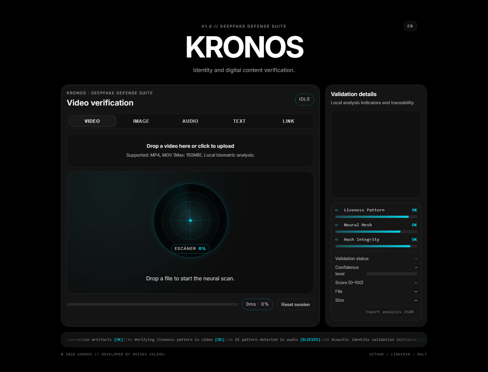

# KRONOS

KRONOS is a SvelteKit prototype for local digital-media integrity analysis. It estimates manipulation or synthesis risk in images, video, audio, text and links by combining forensic, biometric, metadata and container signals into an explainable score.

KRONOS es un prototipo SvelteKit para análisis local de integridad de medios digitales. Estima el riesgo de manipulación o síntesis en imágenes, vídeo, audio, texto y enlaces combinando señales forenses, biométricas, de metadatos y de contenedor en una puntuación explicable.



---

## Español

### Qué hace

KRONOS ofrece una interfaz de auditoría para cargar evidencias digitales y obtener:

- `riskScore` de 0 a 100.
- Veredicto operativo: `VERIFICADO`, `SOSPECHOSO` o `ALERTA ROJA`.
- Nivel de confianza.
- Telemetría del análisis local.
- Exportación JSON para reproducir o revisar resultados.
- Informe/certificado visual desde la interfaz.

El objetivo no es declarar una verdad absoluta, sino reunir señales técnicas y hacer más trazable una revisión humana.

### Señales analizadas

- Forense visual: ELA, frecuencia, textura, bordes, ruido, PRNU proxy y doble cuantización DCT.
- Vídeo: consistencia temporal, landmarks faciales, parpadeo, jitter y comparación entre cara/fondo.
- Señal fisiológica aproximada: rPPG sobre canal verde en regiones de mejilla cuando el material lo permite.
- Contenedor MP4: estructura de boxes y pistas de empaquetado o transcodificación.
- Metadatos: origen no verificable, software de terceros y huellas de encoder.
- Audio/texto/enlace: flujos de verificación integrados en la UI, con tratamiento conservador cuando la evidencia no se descarga o no es concluyente.

### Arquitectura del proyecto

- `src/routes/+page.svelte`: pantalla principal de KRONOS.
- `src/lib/components/Scanner/VideoProcessor.svelte`: flujo de carga, pestañas de análisis, scoring en UI y exportación.
- `src/lib/ensemble/EnsembleManager.ts`: agregación ponderada de especialistas y explicación por votos.
- `src/lib/forensics/*`: módulos de señales forenses avanzadas.
- `src/lib/stores/scanner.ts`: estado compartido del escáner.
- `scripts/replay-ensemble.ts`: replay de sidecars `*.kronos.json` para comparar scoring.
- `sanity/*`: configuración CMS heredada/disponible para contenido.

Nota honesta: el repositorio conserva componentes y copys heredados de una plantilla NovaKit en rutas y módulos secundarios. La experiencia principal actual es KRONOS.

### Límites

KRONOS es I+D, no una prueba forense/legal. Puede producir falsos positivos y falsos negativos, especialmente con material recomprimido, legacy, mal iluminado, editado por apps sociales o generado con modelos recientes. Los resultados deben leerse como señales de riesgo para revisión, no como veredictos judiciales.

### Requisitos

- Node.js 18 o superior, recomendado Node.js 20+.
- npm.

### Uso local

```bash
npm install
npm run dev
```

La app se abre normalmente en:

```text
http://localhost:5173
```

### Comandos útiles

```bash
npm run check
npm run build
npm run replay:ensemble
npm run replay:ensemble:impute-video
npm run benchmark
```

El proyecto no define actualmente scripts `format`, `format:check`, `lint` ni `test`.

### Licencia

Este repositorio usa la licencia MIT. Consulta [`LICENSE`](LICENSE).

---

## English

### What It Does

KRONOS provides an audit interface for digital evidence and returns:

- A 0-100 `riskScore`.
- An operational verdict: `VERIFICADO`, `SOSPECHOSO` or `ALERTA ROJA`.
- Confidence level.
- Local-analysis telemetry.
- JSON export for replay and review.
- A visual report/certificate from the UI.

The goal is not to claim absolute truth. KRONOS gathers technical signals and makes human review more traceable.

### Signals Used

- Visual forensics: ELA, frequency, texture, edges, noise, PRNU proxy and DCT double-quantization hints.
- Video: temporal consistency, facial landmarks, blink behavior, jitter and face/background comparisons.
- Approximate physiological signal: green-channel rPPG over cheek regions when the source allows it.
- MP4 container checks: box structure and packaging/transcoding hints.
- Metadata: unverifiable origin, third-party software and encoder fingerprints.
- Audio/text/link: UI-integrated verification flows, handled conservatively when evidence is unavailable or inconclusive.

### Project Structure

- `src/routes/+page.svelte`: main KRONOS screen.
- `src/lib/components/Scanner/VideoProcessor.svelte`: upload flow, analysis tabs, UI scoring and exports.
- `src/lib/ensemble/EnsembleManager.ts`: weighted specialist aggregation and explainable votes.
- `src/lib/forensics/*`: advanced forensic signal modules.
- `src/lib/stores/scanner.ts`: shared scanner state.
- `scripts/replay-ensemble.ts`: replay for `*.kronos.json` sidecars to compare scoring.
- `sanity/*`: CMS configuration kept available for content workflows.

Honest note: the repository still contains secondary components and copy inherited from a NovaKit template. The current primary experience is KRONOS.

### Limits

KRONOS is an R&D prototype, not legal or forensic proof. It can produce false positives and false negatives, especially with recompressed, legacy, poorly lit, socially edited or newly generated material. Treat results as risk signals for review, not as judicial authenticity claims.

### Requirements

- Node.js 18 or newer, Node.js 20+ recommended.
- npm.

### Local Usage

```bash
npm install
npm run dev
```

The app usually opens at:

```text
http://localhost:5173
```

### Useful Commands

```bash
npm run check
npm run build
npm run replay:ensemble
npm run replay:ensemble:impute-video
npm run benchmark
```

The project does not currently define `format`, `format:check`, `lint` or `test` scripts.

### License

This repository is licensed under MIT. See [`LICENSE`](LICENSE).
